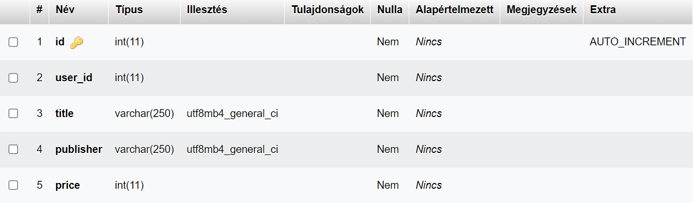

# Rendszerterv

## 1. A rendszer célja

A megrendelő szeretne egy könyv/játék kölcsönzőt üzemeltetni. Ehhez szeretne egy programot, amiben a felhasználók megtekinthetik az aktuális készletet, illetve kikölcsönözhetik a számukra megfelelő termékeket.

## 2. Projektterv
 **Developer Team**: 
 - Kaponya Martin
 - Mihály Balázs
 
 A projekt elkészítése során a Java nyelvet használjuk. A feladat kiemelt pontja a tervezési minták használata.

Frontend: Mihály Balázs, Kaponya Martin
Backend: Mihály Balázs, Kaponya Martin
Tesztelés: Mihály Balázs, Kaponya Martin

## 3. Üzleti feladatok modellje

## 4. Követelmények
### Funkcionális követelmények:
| Id | Név | Leírás |
| :---: | --- | --- |
| K1 | Database | Adatok tárolása |
| K2 |  Regisztráció | Fiók létrehozás |
| K3 | Login | Meglévő felhasználóval bejelentkezés |
| K4 | Add | Adatbázishoz hozzáadás |
| K5 | Update | Adatbázisból módosításás |
| K6 | Delete | Adatbázisból törlés |

## 5. Funkcionális terv
### Rendszerszereplők:
- **Guest**
- **User**

### Rendszerhasználati esetek és lefutásaik:
**Guest:**
- Amennyiben rendelkezik érvényes fiókkal, bejelentkezhet a "Login" menüpontra kattintva
- Felhasználói fiók hiányában regisztrálhat a "Registration" fül alatt

**User:**
- Bejelentkezhet felhasználói fiókjába a "Login" menüpontra kattintva
- Az "Add" gombra kattintva új panelen keresztül hozzáadhat egy productot a listájához
- Az "Update" gombra kattintva a listájából szerkesztheti az egyik productját
- Kijelentkezhet fiókjából a "Log out" gomb segítségével

### Menükhöz tartozó specifikációk:

| Modul       | ID | Név                      | v.  | Kifejtés                                                                 |
|-------------|----|--------------------------|-----|--------------------------------------------------------------------------|
| Jogosultság | T1 | Bejelentkezési felület   | 1.0 | A felhasználó az email címe és jelszava segítségével bejelentkezhet. Ha a megadott email vagy jelszó nem megfelelő, akkor a felhasználó hibaüzenetet kap.                                                               |
| Jogosultság | T2 | Regisztráció | 1.0 | A felhasználó az email címével és jelszavának megadásával regisztrálja magát. A jelszó tárolása kódolva történik az adatbázisban. Ha valamelyik adat ezek közül hiányzik vagy nem felel meg a követelményeknek, akkor a rendszer értesíti erről a felhasználót. |
| Jogosultság | T3 | Kijelentkezés | 1.0 | A bejelentkezett felhasználók a kijelentkezés gombra kattintva kitudnak jelentkezni, amely a bejelentkező felületre irányíja őket. |

## 6. Fizikai környezet
Megvásárolt komponenseket nem tartalmaz. 
A program a legtöbb asztali operációs rendszeren elfut, tekintettel arra, hogy Java nyelven íródott, aminek sok operációs rendszeren van futtató környezete.

### Adatbázis rendszer

A programhoz MySQL adatábzist szervert használunk.

### Fejlesztői eszközök
- IntelliJ IDEA Ultimate
- Visual Studio Code
- XAMPP / WAMP

## 7. Adatbázis terv

## 8. Implementációs terv
- Az OCP (Open-Closed Principle) és a SRP (Single Responsiblity Principle) betartásával készüljön az alkalmazás java programnyelven.
- Az alkalmazásban felhasznált további tervezési minták a Command és a Strategy. 
- Az adatok tárolása adatbázisban történik meg.
- Unit tesztek készítése 
- Logolás

## 9. Tesztterv
A program tesztelése elsősorban unit tesztek segítségével történik, manuális tesztelésen kívül.

## 12. Használt technológiák
- Trello: A projekt szervezéséhez és kezeléséhez
- Git(Github): verziókezelés
- MySQL: adatbázisszerver
- Visual Studio Code / dillinger.io: dokumentáció megírásához
- IntelliJ IDEA: programkód megírásához
- Diagrams.net - az ábárák megvalósításához
